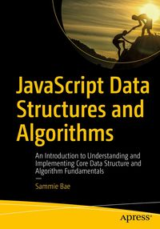

# Eloquent JavaScript 
### 3rd edition, by Marijn Haverbeke

This is a book about JavaScript, programming, and the wonders of the digital. You can read it online here, or get your own paperback copy.

Written by Marijn Haverbeke.

## Contents

| No. | Chapters       |
|:-------:|:--------------:|
||Introduction||
||**(Part 1: Language)**||
|1.| Values, Types, and Operators||
|2.| Program Structure||
|3.| Functions||
|4.| Data Structures: Objects and Arrays||
|5.| Higher-order Functions||
|6.| The Secret Life of Objects||
|7.| Project: A Robot||
|8.| Bugs and Errors||
|9.| Regular Expressions||
|10.| Modules||
|11.| Asynchronous Programming||
|12.| Project: A Programming Language||
||**(Part 2: Browser)**||
|13.| JavaScript and the Browser||
|14.| The Document Object Model||
|15.| Handling Events||
|16.| Project: A Platform Game||
|17.| Drawing on Canvas||
|18.| HTTP and Forms||
|19.| Project: A Pixel Art Editor||
||**(Part 3: Node)**||
|20.| Node.js||
|21.| Project: Skill-Sharing Website||

A paper version of Eloquent JavaScript, including an additional chapter, is being brought out by No Starch Press.

Licensed under a Creative Commons attribution-noncommercial license. All code in this book may also be considered licensed under an MIT license.

Illustrations by various artists: Cover and chapter illustrations by Madalina Tantareanu. Pixel art in Chapters 7 and 16 by Antonio Perdomo Pastor. Regular expression diagrams in Chapter 9 generated with regexper.com by Jeff Avallone. Village photograph in Chapter 11 by Fabrice Creuzot. Game concept for Chapter 15 by Thomas Palef.

The third edition was made possible by 325 financial backers, most notably Nextjournal and Holberton School. The second edition was supported by 454 backers, with significant contributions from Mozilla, Hack Reactor, and Ghostery.
